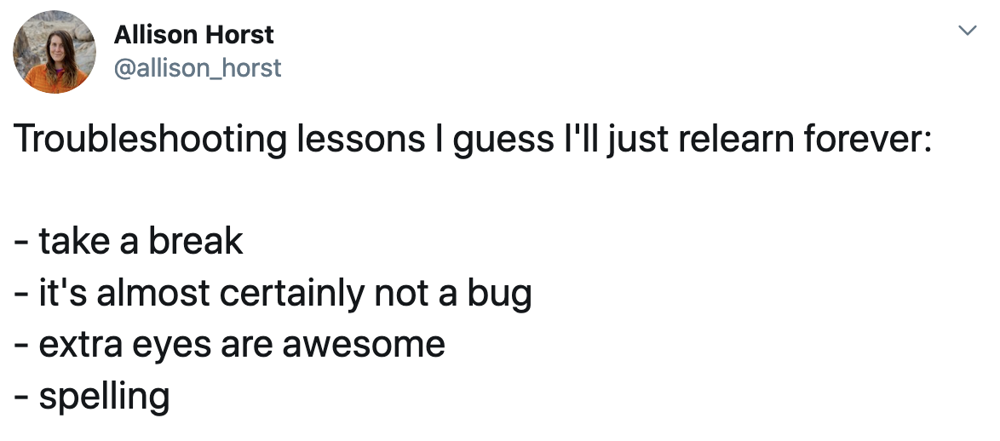
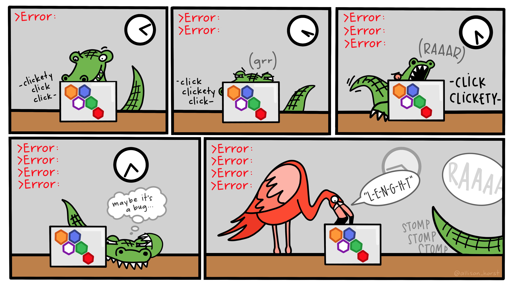

```{r setup, message=FALSE, warning=FALSE, include=FALSE}
library(tidyverse)
library(tinytable)

knitr::opts_chunk$set(fig.align = "center")
```

:::: {.grid .course-details .course-details-smaller}

::: {.g-col-12 .g-col-sm-6 .g-col-md-4}
### Instructor

- []{.fa-li} []()
- []{.fa-li} 
- []{.fa-li} <a href='mailto:'></a>
:::

::: {.g-col-12 .g-col-sm-6 .g-col-md-4}
### Course details

- []{.fa-li} 
- []{.fa-li} 
- []{.fa-li} 
- []{.fa-li} 
:::

::: {.g-col-12 .g-col-md-4 .contact-policy}
### Contacting me


:::

::::

## Learning Outcomes

### Course Description

Data rarely speaks for itself. On their own, raw data can be difficult to interpret. Effective data visualization helps us identify patterns, communicate findings, and make complex information more understandable.

In this class, you’ll learn how to use principles of graphic and data design to create clear, effective, and informative visualizations. You’ll also learn to think critically about how data are represented and how visualization choices can shape the way information is interpreted.

By the end of this course, you will become (1) literate in data and graphic design principles, and (2) an ethical data communicator, by producing beautiful, powerful, and clear visualizations of your own data. Specifically, you should:

- Understand the principles of data and graphic design
- Evaluate the credibility, ethics, and aesthetics of data visualizations
- Create well-designed data visualizations with appropriate tools
- Share data and graphics in open forums
- Feel comfortable with R
- Be curious and confident in consuming and producing data visualizations

This class will expose you to [R](https://cran.r-project.org/)—one of the most popular, sought-after, and in-demand statistical programming languages. Armed with the foundation of R skills you'll learn in this class, you'll know enough to be able to find how to visualize and analyze any sort of data-based question in the future.


## Important pep talk!

I believe you can succeed in this class.

Learning R can be challenging at first—it is a little like learning a new language. You may encounter error messages, write code that does not work as expected, or spend time trying to solve what turns out to be a small problem. This is a normal part of learning to program.

Hadley Wickham, Chief Scientist at Posit and a major contributor to R packages you’ll use in this course, including {ggplot2}, has offered this useful advice—[made this wise observation](https://r-posts.com/advice-to-young-and-old-programmers-a-conversation-with-hadley-wickham/): 

> It's easy when you start out programming to get really frustrated and think, "Oh it's me, I'm really stupid," or, "I'm not made out to program." But, that is absolutely not the case. Programming can sometimes be frustrating, even for experienced users. If you find yourself stuck, take a break, review your code and error messages, consult the course resources, or reach out for help. Learning how to troubleshoot problems is an important part of learning R.


```{r}
#| include: false
#| eval: false

# https://twitter.com/allison_horst/status/1213275783675822080
```

{width="60%" fig-align="center"}




## Required Materials

All of the readings and software in this class are **free**. There are free online versions of all the textbooks, R and RStudio are inherently free, and you can use [free vector editing software](resource/graphics-editors.qmd).

### Books, articles, and other materials

We'll rely heavily on these books, which are all available online (**for free!**). I recommend getting the printed versions of these books if you are interested, but it is not required.

- Alberto Cairo, *The Truthful Art: Data, Charts, and Maps for Communication* (Berkeley, California: New Riders, 2016). (https://www.amazon.com/Truthful-Art-Data-Charts-Communication/dp/0321934075). 

  A **free** eBook version is available through GSU's library through O'Reilly's Higher Education database. The easiest way to access it is to visit a special URL (<http://go.oreilly.com/georgia-state-university>), log in with your GSU account, and then search for "The Truthful Art".

- Kieran Healy, *Data Visualization: A Practical Introduction* (Princeton: Princeton University Press, 2018), <http://socviz.co/>. [**FREE** online](http://socviz.co/); (https://www.amazon.com/Data-Visualization-Introduction-Kieran-Healy/dp/0691181624/).

- Claus E. Wilke, *Fundamentals of Data Visualization* (Sebastopol, California: O’Reilly Media, 2018), <https://serialmentor.com/dataviz/>. [**FREE** online](https://clauswilke.com/dataviz/); (https://www.amazon.com/Fundamentals-Data-Visualization-Informative-Compelling/dp/1492031089). An eBook version is also available through [the O'Reilly database](http://go.oreilly.com/georgia-state-university), but you can just use [the online version](https://clauswilke.com/dataviz/).

There will occasionally be additional articles and videos to read and watch. When this happens, links to these other resources will be included on the content page for that session.

### R and RStudio

You will do all of your analysis with the open source (and free!) programming language [R](https://cran.r-project.org/). You will use [RStudio](https://www.rstudio.com/) as the main program to access R. **Think of R as an engine and RStudio as a car dashboard**—R handles all the calculations produces the actual statistics and graphical output, while RStudio provides a nice interface for running R code.

R is free, but it can sometimes be a pain to install and configure. To make life easier, you can (and should!) use the free [Posit.cloud](http://posit.cloud/) service, which lets you run a full instance of RStudio in your web browser. This means you won't have to install anything on your computer to get started with R! 

Posit.cloud is convenient, but it can be slow and it is not designed to be able to handle larger datasets or more complicated analysis and graphics. You also can't use your own custom fonts with Posit.cloud. Over the course of the semester, you'll probably want to get around to installing R, RStudio, and other R packages on your computer and wean yourself off of Posit.cloud. This isn't 100% necessary, but it's helpful.

You can [find instructions for installing R, RStudio, and all the tidyverse packages here.](resource/install.qmd)

### Online help

Data science and statistical programming can be difficult. Computers are stupid and little errors in your code can cause hours of headache (even if you've been doing this stuff for years!).

Fortunately there are tons of online resources to help you with this. 

#### Getting help

Please reach out by email when you have questions about the readings, exercises, or mini projects. Email is the best way to contact me, and I will generally respond to course-related messages within 24–48 hours on weekdays.

When asking for help with code, include the relevant code, the complete error message, and a short explanation of what you expected to happen. These details make it much easier for me to help you quickly.

#### Online communities

The R community has many useful online resources. You can find discussions and examples by searching for #rstats on platforms such as Bluesky and LinkedIn. The Posit Community is also a useful forum for questions related to R, RStudio, the tidyverse, Shiny, and related tools.

When searching the web for R help, it is often useful to include R, rstats, or the name of the package in your search. For example, instead of searching for "scatterplot," try "R ggplot2 scatterplot."

You can also check out the [Posit Community](https://community.rstudio.com/), a forum specifically designed for people using RStudio and the tidyverse (i.e. you).


## AI and Large Language Models

AI tools such as ChatGPT and other large language models (LLMs) are increasingly common, and you may use them while learning. However, these tools should support your learning rather than replace the work of thinking, writing, and coding.

Be especially careful when using AI-generated code. Copying and running code without understanding what it does—sometimes called vibe coding—will not help you develop the skills this course is designed to teach. If you use AI to help troubleshoot or explain code, you should still be able to explain the code, modify it, and understand the results.

The same principle applies to writing. The purpose of writing is not simply to produce words; it is to organize and clarify your thinking. AI-generated text should not replace your own engagement with the course materials.

A key theme of this class is the search for evidence and meaningful insights from data. Use AI thoughtfully, critically, and as a learning tool—not as a substitute for your own analysis.

In your session check-ins and assignments, I want to see good engagement with the readings. I want to see your thinking process. I want to see you make connections between the readings. I want to see your personal insights. 

AI should support your learning rather than replace your own thinking, writing, or coding. You are responsible for understanding any code or content you submit. You should be able to explain what your code does, modify it when needed, and interpret the results it produces.

AI-generated information and code can be incomplete, inaccurate, or fabricated. You are responsible for verifying your work, including data sources, citations, code, and results. Submitting fabricated data, sources, citations, or analyses is not acceptable.

When an assignment requires independent work or restricts the use of AI, those requirements will be stated in the assignment instructions. All work must comply with Georgia State University's Policy on Academic Honesty.

## Meeting Expectations

We have no regularly scheduled meeting times. 

Instead, 100% of the class content is asynchronous. You can do the readings and watch the videos on your own schedule at whatever time works best for you. Many of you work full time and you have childcare and parental care responsibilities, leaving you with only evenings for coursework. I've designed this asynchronous system with *you specifically* in mind. 

Most course sessions include (1) a set of readings and an accompanying lecture, (2) a lesson, (3) an example with lots of reference code, and (4) a short assignment. The [schedule page](schedule.qmd) provides an overview of all these moving parts.

I recommend following this general process for each session:

- Do everything on the content page ()
- Work through the lesson page ()
- Complete the assignment () while referencing the example ()

## Learning and student support

I want you to succeed in this course and to learn the skills needed to confidently work with data and create effective visualizations. I also recognize that students may encounter academic, professional, family, or personal circumstances that affect their coursework.

If you are having difficulty keeping up with the course or understanding the material, please reach out as early as possible. You do not need to share personal or private details. We can discuss available options and identify appropriate university resources when needed.

Please do not struggle with course material in silence. Ask questions, use the available course resources, and contact me when you need clarification or additional guidance.

## Course policies

**Be nice. Be honest. Don't cheat.**

We will also follow [Georgia State's Code of Conduct](https://codeofconduct.gsu.edu/).

This syllabus reflects a plan for the semester. Deviations may become necessary as the course progresses.

### Student hours

Office hours are Tuesdays from 11:30 AM–12:30 PM. You may also contact me by email to arrange another mutually convenient meeting time. Meetings may be held online or in person.

### Late work

Assignments are due on the dates listed in the course schedule. Late work will generally receive a deduction of 0.5 points for each day it is late and may not be accepted more than two weeks after the original deadline. If extenuating circumstances affect your ability to complete an assignment on time, please contact me as early as possible so that we can discuss available options.


### Counseling and Psychological Services (CPS)

College and professional studies can sometimes bring academic, personal, and emotional challenges. You may feel overwhelmed, experience anxiety or depression, or face challenges related to relationships, family responsibilities, or other circumstances. Counseling and Psychological Services (CPS) provides free, confidential support for students experiencing mental health or emotional concerns. CPS is staffed by professional psychologists who understand the diverse needs of college and professional students. Please do not hesitate to contact CPS if you need support—seeking assistance is a positive step toward your well-being.

### Basic needs security

If you have difficulty affording groceries or accessing sufficient food to eat every day, or if you lack a safe and stable place to live, and you believe this may affect your performance in this course, please contact the [Dean of Students](https://deanofstudents.gsu.edu/) for support. They can provide a host of services including free groceries from the [Panther Pantry](https://nutrition.gsu.edu/panther-pantry/) and assisting with homelessness with the [Embark Network](https://deanofstudents.gsu.edu/student-assistance/embark/). Additionally, please talk to me if you are comfortable in doing so. This will enable me to provide any resources that I might possess.

### Student safety and victim assistance

If you are in immediate danger, call 911 or Georgia State University Police at 404-413-3333.

Students who have experienced sexual assault, dating or domestic violence, stalking, harassment, or other forms of victimization may contact Georgia State's Student Victim Assistance program for confidential support and information about available options and resources.

Please be aware that faculty members are generally considered responsible employees under university policy and may be required to share reports of sexual misconduct with appropriate university officials. Students seeking confidential assistance may contact Student Victim Assistance.

### Academic Integrity

Students are expected to follow Georgia State University's Policy on Academic Honesty and to submit work that reflects their own efforts, except where collaboration or the use of outside tools is explicitly permitted. Academic dishonesty, including plagiarism, cheating, unauthorized collaboration, or fabrication, will be addressed in accordance with university policy and may result in academic and/or disciplinary consequences.

If you are unsure whether a particular form of collaboration or assistance is permitted for an assignment, please ask before submitting your work.

### Accessibility Statement

Students who require disability-related accommodations should register with Georgia State University's Access and Accommodations Center (AACE). Students with approved accommodations should provide their Faculty Notification Letter to the instructor so that the accommodations can be implemented.

Students are encouraged to communicate approved accommodation needs as early as possible, but accommodations may be requested during the semester in accordance with university procedures.


## Grading Criteria

You can find descriptions for all the assignments on the [assignments page](assignment/index.qmd).

```{r assignments-grades, include=FALSE}
assignments <- tribble(
  ~Points,  ~Assignment,
  15 * 10 , "Session check-ins (15 × 10)",
  15 * 10 , "Exercises (15 × 10)",
  30      , "#TidyTuesday",
  75      , "Mini project 1",
  75      , "Mini project 2",
  200     , "Final project"
) |>
  mutate(Percent = Points / sum(Points)) |> 
  select(Assignment, Points, Percent) |> 
  janitor::adorn_totals(where = "row")

grading <- tribble(
  ~Grade, ~Range,  ~Grade1, ~Range1,
  "A",  "93–100%", "C",  "73–76%",
  "A−", "90–92%",  "C−", "70–72%",
  "B+", "87–89%",  "D+", "67–69%",
  "B",  "83–86%",  "D",  "63–66%",
  "B−", "80–82%",  "D−", "60–62%",
  "C+", "77–79%",  "F",  "< 60%"
)
```

::: {.centered-table}

```{r show-assignments-table, echo=FALSE}
assignments |>
  tt() |> 
  style_tt(line = "b", line_width = 0.05, line_color = "#d3d8dc") |> 
  style_tt(i = 7, bold = TRUE, line = "t", line_width = 0.1, line_color = "#d3d8dc") |> 
  format_tt(j = 3, fn = scales::label_percent()) |> 
  format_tt(escape = TRUE)
```

:::

::: {.centered-table}

```{r show-grades-table, echo=FALSE}
grading |>
  setNames(c("Grade", "Range", "Grade", "Range")) |> 
  tt() |> 
  style_tt(line = "b", line_width = 0.05, line_color = "#d3d8dc") |> 
  style_tt(i = 1, line = "t", line_width = 0.1, line_color = "#d3d8dc") |> 
  style_tt(j = 2, bootstrap_css = "border-right: 0.1em dashed #d3d8dc;")
```

:::


:::::: {.content-visible when-format="typst"}

## Schedule

::: {.schedule-table}

```{r}
#| label: schedule-table
#| warning: false
#| message: false
#| echo: false

schedule <- read_csv(here::here("data/schedule.csv")) |>
  mutate(session = case_when(
    is.na(session) & str_detect(title, "session") ~ lag(session),
    is.na(session) ~ glue::glue("Thing {row_number()}"),
    .default = session
  )) |> 
  mutate(
    deadline_actual = update(
      date,
      hour = hour(deadline),
      minute = minute(deadline)
    ),
    deadline_nice = format(deadline_actual, "%I:%M %p"),
    date_nice = case_when(
      is.na(end_date) ~ format(date, "%B %e"),
      !is.na(end_date) ~ glue::glue('{format(date, "%B %e")}–{format(end_date, "%B %e")}')
    )
  ) |>
  mutate(
    title = case_when(
      str_detect(content, "class") ~ glue::glue("*{title}*"),
      !is.na(deadline) ~ glue::glue("{title} _(due by {deadline_nice})_"),
      .default = title
    )
  ) |>
  select(group, session, date_nice, title)

# Figure out alternating topics for special styling
tbl_data <- schedule |>
  group_by(session) |>
  mutate(
    is_first = row_number() == 1,
    session = case_when(
      str_starts(session, "Thing") ~ "Project",
      is_first ~ session,
      .default = ""
    )
  ) |>
  ungroup() |>
  # Add new rows for the group rows so that the row index values match the tt() table
  reframe(
    session = c(NA, session),
    date_nice = c(NA, date_nice),
    title = c(NA, title),
    is_first = c(NA, is_first),
    .by = group
  ) |>
  mutate(row_id = row_number()) |>
  # Now that we have the correct row numbers, get rid of those placeholder rows
  drop_na(is_first) |>
  # Find which subgroup rows cluster together and mark their oddness/evenness
  mutate(
    session_sequential = cumsum(is_first),
    session_highlight = session_sequential %% 2
  ) |> 
    # Typst doesn't like #TidyTuesday
  mutate(title = str_replace(title, "#TidyTuesday", "\\\\#TidyTuesday"))

# Extract the rows that should be highlighted
highlight_rows <- tbl_data |>
  filter(session_highlight == 1) |>
  pull(row_id)

# Make the table
tbl_data |>
  select(session, date_nice, title) |>
  tt(colnames = FALSE) |>
  group_tt(i = tbl_data$group) |>
  style_tt("groupi", bold = TRUE, line = "b", line_width = 0.05) |>
  style_tt(i = highlight_rows, background = "#eeeeee") |>
  format_tt(j = 3, markdown = TRUE)
```

:::

::::::
